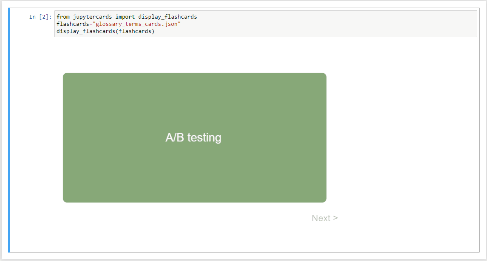

# ultranauts-istqb-studyguide
A python based project to run Jupyter notecards for ISTQB foundation exam materials. It also uses automation to collect and update vocabulary from the official ISTQB website

# General use
Running the example.py script as a standalone should load the glossary page of the ISTQB webpage, and handle any popups
related to cookies. If a .pkl file already exists that saves cookie data then the script will load the previous session
and continue with the main portion. After the webpage is scrapped then everything is saved into a .md file, which is
then converted to a .json file.

The script for the Jupyter notebook should load the notecards, though presently an issue is present with the notecards
in terms of moving to the next card. AS shown in the video example the user will transition to the next card, but the
previous card will load instead. Looking at the HTML code it seems that it is juggling between three cards as opposed to
two cards at a time.

## Kernel set up

For the Jupyter Notebook the venv should be set up as the main interpreter. This can be achieved by running the CLI
command:

`ipython kernel install --user --name=venv`